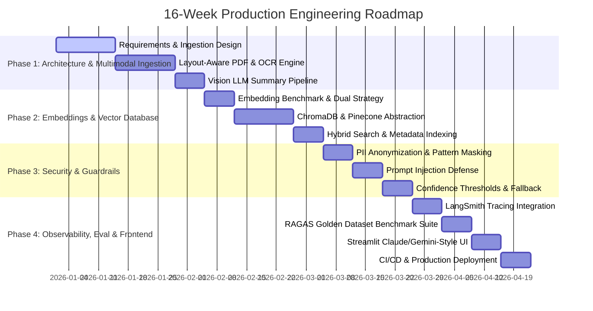

# Project Implementation Timeline - Multi-Modal Document Intelligence

This timeline outlines the realistic **4-Month (16-Week)** engineering roadmap for designing, implementing, evaluating, and deploying the Multi-Modal Document Intelligence Platform in a production enterprise environment.

---

---

## Phase Breakdown

### Month 1: Architecture, Ingestion & Multimodal Processing (Weeks 1–4)
- **Week 1: Requirements & Schema Specification**
  - Defined document ingestion specs for PDFs, scanned images, financial tables, and visual infographics.
  - Specified layout-aware chunking strategy (Text + Table + Vision Summaries).
- **Week 2: Layout-Aware PDF & OCR Ingestion Engine**
  - Integrated PyPDF for native digital text extraction with page boundary metadata.
  - Implemented Tesseract OCR fallback engine for low-DPI scans and image uploads.
- **Week 3: Vision LLM Table & Graphic Summarizer**
  - Developed Vision LLM integration (GPT-4o-mini / Gemini Vision) converting visual financial graphics and complex multi-column tables into dense textual descriptions.
- **Week 4: Document Pipeline Integration**
  - Unified digital text, OCR output, and Vision LLM summaries into standardized `ExtractedChunk` schema with page-level bounding box tags.

### Month 2: Embeddings, Vector Indexing & Retrieval Architecture (Weeks 5–8)
- **Week 5: Embedding Model Benchmarking**
  - Evaluated local Hugging Face embeddings (`sentence-transformers/all-MiniLM-L6-v2`, `BAAI/bge-small-en-v1.5`) vs cloud OpenAI (`text-embedding-3-small`).
- **Week 6: Vector Store Abstraction Layer (ChromaDB + Pinecone)**
  - Built `VectorStoreManager` supporting local persistence (`ChromaDB`) for dev/testing and cloud (`Pinecone`) for production.
- **Week 7: Metadata Filtering & Context Retrieval**
  - Implemented Maximal Marginal Relevance (MMR) search to eliminate duplicate chunks.
  - Added strict page and source document metadata filtering.
- **Week 8: Vector Store Performance Tuning**
  - Optimized vector distance metrics (Cosine similarity HNSW index) and tuned chunk overlap parameters (500 characters / 50 overlap).

### Month 3: Enterprise Safety, Guardrails & Fallback Mechanisms (Weeks 9–12)
- **Week 9: PII Detection & Anonymization Engine**
  - Built regex & rule-based `PIIMasker` redacting emails, phone numbers, SSNs, credit cards, and API tokens prior to indexing.
- **Week 10: Prompt Injection & Adversarial Scanner**
  - Developed heuristic `PromptInjectionScanner` to prevent system prompt leakage, jailbreaks, and instructions override attempts.
- **Week 11: Grounding & Confidence Thresholding**
  - Engineered `GuardrailEvaluator` to compute retrieval confidence scores.
- **Week 12: Human Fallback & Handover System**
  - Constructed `FallbackHandler` routing low-confidence or safety-blocked queries to human document analysts.

### Month 4: Observability, RAGAS Evaluation & UI Deployment (Weeks 13–16)
- **Week 13: LangSmith Observability & Tracing**
  - Integrated `LangSmith` for real-time latency monitoring, token consumption metrics, and RAG execution chain tracing.
- **Week 14: RAGAS Benchmark & Golden Dataset Evaluation**
  - Built synthetic golden dataset harness evaluating Faithfulness (>90%), Answer Relevance (>88%), and Context Recall (>85%).
- **Week 15: Streamlit ChatGPT/Claude/Gemini-Style Dashboard**
  - Built user-facing Streamlit application featuring dark mode, sidebar document workspace, chat thread, and page-level source citations.
- **Week 16: CI/CD Pipeline & GitHub Release**
  - Automated unit testing with `pytest`, established GitHub repository, and documented architecture for deployment.
